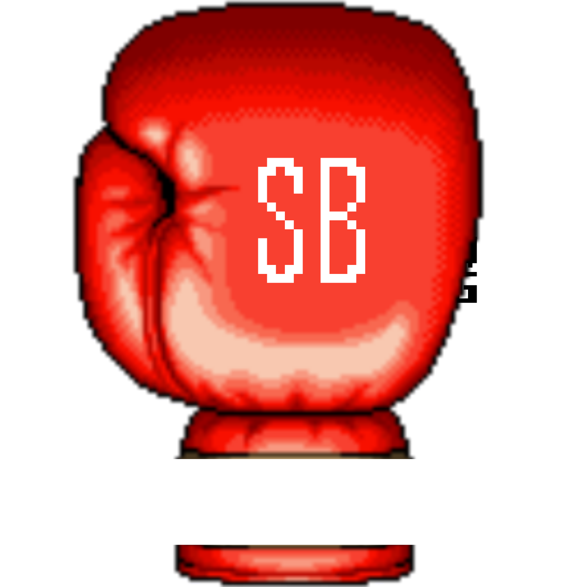
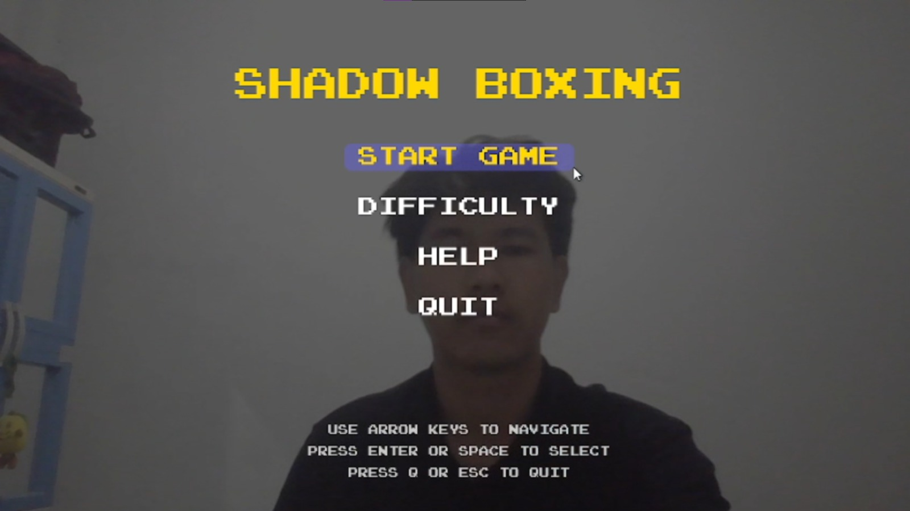
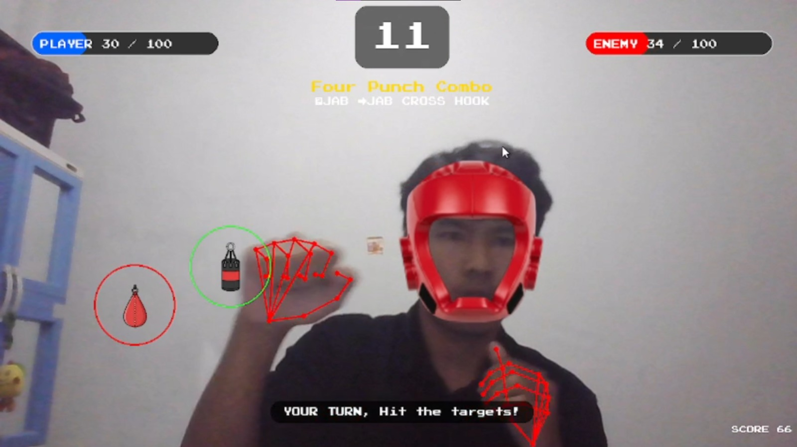
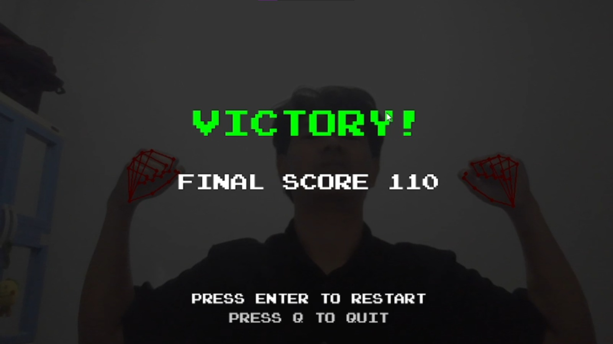

<div align="center">
  <a href="https://github.com/Aziz097/shadow-boxing">
    
  </a>

  <h2 align="center">Shadow Boxing</h2>

  <p align="center">
    Interactive AI-Powered Boxing Game with Real-Time Motion Detection
    <br />
    <a href="https://github.com/Aziz097/shadow-boxing"><strong>Explore the docs »</strong></a>
    <br /><br />
    <a href="https://github.com/Aziz097/shadow-boxing">View Demo</a>
    ·
    <a href="https://github.com/Aziz097/shadow-boxing/issues/new?labels=bug&template=bug-report---.md">Report Bug</a>
    ·
    <a href="https://github.com/Aziz097/shadow-boxing/issues/new?labels=enhancement&template=feature-request---.md">Request Feature</a>
  </p>
</div>

<!-- BADGES -->
<div align="center">

[![Python Version][python-shield]][python-url]
[![MIT License][license-shield]][license-url]
[![Contributors][contributors-shield]][contributors-url]
[![Issues][issues-shield]][issues-url]

</div>

<!-- TABLE OF CONTENTS -->
<details>
  <summary>Table of Contents</summary>
  <ol>
    <li>
      <a href="#about-the-project">About The Project</a>
      <ul>
        <li><a href="#built-with">Built With</a></li>
        <li><a href="#key-features">Key Features</a></li>
      </ul>
    </li>
    <li>
      <a href="#getting-started">Getting Started</a>
      <ul>
        <li><a href="#prerequisites">Prerequisites</a></li>
        <li><a href="#installation">Installation</a></li>
      </ul>
    </li>
    <li><a href="#usage">Usage</a></li>
    <li><a href="#game-mechanics">Game Mechanics</a></li>
    <li><a href="#project-structure">Project Structure</a></li>
    <li><a href="#logbook">Development Logbook</a></li>
    <li><a href="#roadmap">Roadmap</a></li>
    <li><a href="#contributing">Contributing</a></li>
    <li><a href="#license">License</a></li>
    <li><a href="#team">Team</a></li>
    <li><a href="#acknowledgments">Acknowledgments</a></li>
  </ol>
</details>

<!-- ABOUT THE PROJECT -->
## About The Project

[![Shadow Boxing Demo][product-screenshot]](https://github.com/Aziz097/shadow-boxing)

**Shadow Boxing** adalah game boxing interaktif berbasis computer vision yang menggabungkan teknologi MediaPipe untuk mendeteksi gerakan real-time. Rasakan sensasi bertarung melawan lawan virtual dengan deteksi pukulan dan pertahanan yang akurat menggunakan webcam Anda!

### Why Shadow Boxing?

* 🥊 **Real-time Motion Tracking** - Deteksi akurat untuk punch, defense, dan dodge menggunakan MediaPipe
* 🎮 **Interactive Gameplay** - Sistem combo, phase-based combat, dan dynamic difficulty
* 🔊 **Immersive Audio** - Sound effects dan background music yang menambah pengalaman bermain
* 🎯 **Smart Hitbox System** - Sequential spawning dengan position-based placement dan collision detection
* 📊 **Progressive Difficulty** - 3 level kesulitan dengan parameter yang dapat disesuaikan
* 💻 **Cross-Platform** - Berjalan di Windows, Linux, dan macOS

<p align="right">(<a href="#top">back to top</a>)</p>

### Built With

Teknologi utama yang digunakan dalam project ini:

* [![Python][Python.org]][Python-url]
* [![OpenCV][OpenCV.org]][OpenCV-url]
* [![MediaPipe][MediaPipe.dev]][MediaPipe-url]
* [![Pygame][Pygame.org]][Pygame-url]
* [![NumPy][NumPy.org]][NumPy-url]

<p align="right">(<a href="#top">back to top</a>)</p>

### Key Features

#### 🎯 Advanced Vision System
- **MediaPipe Integration**: Hand tracking (21 landmarks), pose detection (33 landmarks), face mesh (468 landmarks)
- **Multi-hand Detection**: Simultaneous tracking untuk kedua tangan
- **Fist Detection Algorithm**: Angle-based detection dengan threshold tuning
- **Defense Recognition**: Face coverage detection dan dodge mechanism

#### 🥊 Combat Mechanics
- **Sequential Hitbox System**: Hit-to-spawn mechanism dengan minimum distance constraint
- **Position-based Placement**: JAB spawns kiri, CROSS/HOOK spawns kanan
- **Combo System**: 6 combo patterns (JAB JAB, JAB CROSS, JAB JAB CROSS, dst)
- **Damage Calculation**: Base damage × last hit multiplier (1.1x)
- **Enemy AI**: 3-4 combo attacks dengan warning time dan cooldown

#### 🎨 Visual Effects
- **Real-time Rendering**: Pygame-based graphics dengan OpenCV integration
- **Dynamic HUD**: Health bars, combo counter, timer, phase indicator
- **Round Transitions**: Animated splash screens dan fight overlay
- **VFX System**: Hit effects, damage numbers, screen shake

#### 🔊 Audio System
- **LUFS Normalization**: Consistent audio levels at -16 dB
- **Dynamic Sound**: Context-aware SFX (punch, hit, ko, round announcements)
- **Background Music**: Phase-specific BGM (menu, fight, ko)

<p align="right">(<a href="#top">back to top</a>)</p>

<!-- GETTING STARTED -->
## Getting Started

Ikuti langkah-langkah berikut untuk menjalankan game di local machine Anda.

### Prerequisites

* **Python 3.10 atau lebih tinggi**
  ```sh
  python --version
  ```

* **Webcam** (built-in atau external)

* **Dependencies** akan otomatis terinstall via launcher script

### Installation

#### Option 1: Quick Start (Recommended)

Gunakan launcher script untuk instalasi dan menjalankan game secara otomatis:

**Windows:**
```powershell
shadow_boxing.bat
```

**Linux/Mac:**
```bash
chmod +x shadow_boxing.sh
./shadow_boxing.sh
```

Script akan otomatis:
- ✅ Memeriksa instalasi Python
- ✅ Mengecek dan menginstall dependencies
- ✅ Menjalankan game

---

#### Option 2: Manual Installation

1. **Clone repository**
   ```sh
   git clone https://github.com/Aziz097/shadow-boxing.git
   cd shadow-boxing
   ```

2. **Buat virtual environment** (opsional tapi recommended)
   ```sh
   python -m venv venv
   ```

3. **Aktifkan virtual environment**
   
   **Windows:**
   ```powershell
   .\venv\Scripts\Activate.ps1
   ```
   
   **Linux/Mac:**
   ```bash
   source venv/bin/activate
   ```

4. **Install dependencies**
   ```sh
   pip install -r requirements.txt
   ```

5. **Jalankan game**
   ```sh
   python main.py
   ```

<p align="right">(<a href="#top">back to top</a>)</p>

<!-- USAGE -->
## Usage

### Controls

| Key | Action |
|-----|--------|
| `ENTER` | Start Game / Select Menu |
| `ESC` | Pause / Resume Game |
| `Q` | Quit Game |
| `↑` `↓` | Navigate Menu |

### Gameplay Tips

1. **Position Yourself** - Pastikan wajah dan tangan terlihat jelas di kamera
2. **Good Lighting** - Pencahayaan yang baik meningkatkan akurasi deteksi
3. **Make a Fist** - Kepalkan tangan dengan rapat untuk punch detection
4. **Combo Awareness** - Perhatikan combo instruction di layar (JAB JAB CROSS)
5. **Defense Timing** - Tutup wajah atau dodge saat warning muncul

### Demo

![Gameplay Demo][demo-gif]

### Screenshots

<div align="center">
  
  
  
  
  
  
</div>

<p align="right">(<a href="#top">back to top</a>)</p>

<!-- GAME MECHANICS -->
## Game Mechanics

### Phase System

#### 🟢 Player Attack Phase (4 seconds)
- **Sequential Hitbox Spawning**: Hitbox berikutnya muncul setelah hitbox sebelumnya dipukul
- **Position-based Targets**: 
  - JAB: Spawn di sisi kiri (0-50% width)
  - CROSS/HOOK: Spawn di sisi kanan (50-100% width)
- **Exclusion Zones**: Hitbox tidak spawn di area wajah dan body landmarks (shoulders, hips)
- **Minimum Distance**: 150px dari hitbox sebelumnya
- **Damage System**:
  - JAB: 8 damage base
  - CROSS: 15 damage base
  - HOOK: 12 damage base
  - Last hit bonus: **+10%** (1.1x multiplier)

#### 🔴 Enemy Attack Phase
- **Warning Time**: Visual indicator sebelum serangan aktual
  - Easy: 1.2 detik
  - Medium: 1.0 detik
  - Hard: 0.8 detik
- **Combo System**: 2-3 serangan berturut-turut dengan delay 400ms
- **Target Area**: Face detection (prioritas) atau pose landmarks 0-10 (fallback)
- **Defense Mechanisms**:
  - **Block**: Tutup wajah dengan tangan → Damage × 0.2 (80% reduction)
  - **Dodge**: Gerakkan kepala keluar dari target area → 100% avoid

### Difficulty Levels

| Level | Enemy Cooldown | Damage Multiplier | Warning Time | Player Attack |
|-------|---------------|-------------------|--------------|---------------|
| **Easy** | 3.0-5.0s | 0.7x | 1.2s | 4s |
| **Medium** | 2.0-3.5s | 1.0x | 1.0s | 4s |
| **Hard** | 1.5-2.5s | 1.3x | 0.8s | 4s |

### Win Conditions

- ✅ **Victory**: Health tertinggi setelah 3 ronde
- ❌ **Defeat**: Health mencapai 0 (KO)
- 🏆 **Perfect Win**: Tidak menerima damage sama sekali

<p align="right">(<a href="#top">back to top</a>)</p>

<!-- PROJECT STRUCTURE -->
## Project Structure

```
shadow-boxing/
├── 📄 main.py                      # Entry point & game loop
├── 📄 requirements.txt             # Python dependencies
├── 📄 README.md                    # Dokumentasi
├── 🔧 shadow_boxing.bat            # Windows launcher
├── 🔧 shadow_boxing.sh             # Linux/Mac launcher
│
├── 📁 core/                        # Core utilities
│   ├── config.py                   # Centralized settings
│   ├── constants.py                # Game constants
│   ├── math_utils.py               # Math helpers (angle, distance)
│   └── utils.py                    # Font manager, image helpers
│
├── 📁 systems/                     # Game systems
│   ├── vision_system.py            # MediaPipe integration
│   ├── audio_system.py             # Sound & music manager
│   ├── render_system.py            # Graphics rendering
│   └── input_processor.py          # Punch & defense detection
│
├── 📁 entities/                    # Game entities
│   ├── player.py                   # Player state & health
│   └── enemy.py                    # Enemy state & AI
│
├── 📁 game/                        # Game logic
│   ├── game_state.py               # State management
│   ├── hit_box_system.py           # Hitbox generation & collision
│   ├── combo_system.py             # Combo patterns
│   └── enemy_attack_system.py      # Enemy attack mechanics
│
├── 📁 ui/                          # User interface
│   ├── menu_system.py              # Main menu
│   ├── hud_renderer.py             # HUD elements
│   ├── fight_overlay.py            # Round transitions
│   └── result_screen.py            # Game over screen
│
└── 📁 assets/                      # Game assets
    ├── font/                       # PressStart2P.ttf
    ├── sprites/                    # Helm, gloves, KO
    ├── sfx/                        # Sound effects
    └── music/                      # Background music
```

### Architecture Principles

✅ **Separation of Concerns**: Modular structure dengan clear responsibilities  
✅ **Single Responsibility**: Setiap class memiliki satu tugas spesifik  
✅ **DRY Principle**: Reusable utilities dan singleton patterns  
✅ **Clear Naming**: Descriptive variable dan function names  
✅ **Documentation**: Module docstrings dan inline comments  

<p align="right">(<a href="#top">back to top</a>)</p>

<!-- LOGBOOK -->
## Development Logbook

| Tanggal | Kegiatan | Hasil / Progress Pekerjaan |
|---------|----------|----------------------------|
| **10/28/2024** | Project Initialization | • Repository setup • Team coordination • Scope definition |
| **11/09/2024** | Asset Selection & Flow Design | • Fixed assets (sound, sprites, font) • Game flow wireframe • UI mockups |
| **11/10/2024** | Core Implementation | **Systems:** Camera & MediaPipe integration • Audio manager • Visual effects<br><br>**Mechanics:** Punch detection • Defense system • Hitbox generation • Combo patterns<br><br>**UI:** Menu system • HUD renderer • Transitions<br><br>**Features:** 3-level difficulty • Text caching • Fullscreen support |
| **11/17/2024** | Audio Processing & Polish | **Audio:** WAV conversion (44100 Hz, mono, 16-bit PCM) • LUFS normalization (-16 dB)<br><br>**UI Polish:** Font size adjustments • Menu alignment fixes<br><br>**Automation:** Launcher scripts (bat/sh) • Auto dependency check |
| **11/18/2024** | Code Refactoring | • Flatten folder structure • Remove dead code • Module docstrings • Import optimization • Clean code principles (SRP, DRY) • Clear naming conventions |
| **11/24/2024** | Combat System Overhaul | **Major Changes:** Timing-based → sequence system • Hit-to-spawn mechanism • Immediate damage • Last hit 1.1x bonus • Player attack 4s<br><br>**Bug Fixes:** Phase transition • Sequential hitbox consistency • Phantom outline rendering |
| **11/25/2024** | Advanced Features & Bug Fixes | **Improvements:** Hit detection expanded (landmarks 3-20) • Position-based hitbox • Body exclusion zones • Attack duration limit (4s)<br><br>**Bug Fixes:** Hitbox generation failures • 3-tier fallback • Per-hitbox counter • Collision spacing (50px → 30px)<br><br>**Cleanup:** Unused variables removed • Config audit • Debug logging |

<p align="right">(<a href="#top">back to top</a>)</p>

<!-- ROADMAP -->
## Roadmap

### Current Version (v1.0)
- [v] Core gameplay mechanics
- [v] MediaPipe integration
- [v] Sequential hitbox system
- [v] 3-level difficulty
- [v] Audio system
- [v] Basic UI/UX

### Planned Features

#### v1.1 - Polish & Optimization
- [ ] Performance optimization untuk low-end devices
- [ ] Adjustable camera resolution settings
- [ ] Configurable MediaPipe confidence thresholds
- [ ] Save/load game settings

#### v1.2 - Enhanced Gameplay
- [ ] Training mode dengan combo practice
- [ ] Multiplayer mode (local co-op)
- [ ] Leaderboard system
- [ ] Achievement system
- [ ] Character customization

#### v1.3 - Advanced Features
- [ ] AI difficulty adaptation berdasarkan player skill
- [ ] Replay system
- [ ] Custom combo builder
- [ ] Tournament mode
- [ ] Mobile version (Android/iOS)

Lihat [open issues](https://github.com/Aziz097/shadow-boxing/issues) untuk list lengkap features dan known issues.

<p align="right">(<a href="#top">back to top</a>)</p>

<!-- CONTRIBUTING -->
## Contributing

Kontribusi membuat open source community menjadi tempat yang luar biasa untuk belajar, inspirasi, dan kreativitas. Setiap kontribusi yang Anda berikan **sangat dihargai**.

Jika Anda memiliki saran untuk membuat project ini lebih baik, silakan fork repository dan buat pull request. Anda juga bisa membuka issue dengan tag "enhancement".

1. Fork the Project
2. Create your Feature Branch (`git checkout -b feature/AmazingFeature`)
3. Commit your Changes (`git commit -m 'Add some AmazingFeature'`)
4. Push to the Branch (`git push origin feature/AmazingFeature`)
5. Open a Pull Request

### Contribution Guidelines

- Follow existing code style dan naming conventions
- Add comments untuk logika yang kompleks
- Update documentation jika diperlukan
- Test changes secara menyeluruh sebelum submit
- Write clear commit messages

<p align="right">(<a href="#top">back to top</a>)</p>

<!-- LICENSE -->
## License

Distributed under the MIT License. See `LICENSE` for more information.

<p align="right">(<a href="#top">back to top</a>)</p>

<!-- TEAM -->
## Team

### Development Team

| Nama | NIM | Role | GitHub |
|------|-----|------|--------|
| **Aziz Kurniawan** | 122140097 | Lead Developer, Game Logic, MediaPipe Tuning, QA | [@Aziz097](https://github.com/Aziz097) |
| **Harisya Miranti** | 122140049 | UI/UX Designer, Visual Effects, Asset Creation | [@harisya14](https://github.com/harisya14) |
| **Muhammad Yusuf** | 122140193 | MediaPipe Integration, Game Flow, Systems Architecture | [@muhamyusuf](https://github.com/muhamyusuf) |

### Contact

Project Link: [https://github.com/Aziz097/shadow-boxing](https://github.com/Aziz097/shadow-boxing)

<p align="right">(<a href="#top">back to top</a>)</p>

<!-- ACKNOWLEDGMENTS -->
## Acknowledgments

### Technologies & Frameworks
* [MediaPipe by Google](https://google.github.io/mediapipe/) - Hand, Pose, Face detection
* [OpenCV](https://opencv.org/) - Computer vision library
* [Pygame](https://www.pygame.org/) - Game development framework
* [NumPy](https://numpy.org/) - Numerical computing

### Assets & Resources
* [Myinstants](https://www.myinstants.com/) - Sound effects collection
* [Press Start 2P Font](https://www.fontsquirrel.com/fonts/press-start-2p) - Retro game font
* [Imagen by Gemini](https://gemini.google.com/app) - Sprite generation

### Development Tools
* [GitHub Copilot](https://github.com/features/copilot) - AI pair programming
* [Qwen AI](https://qwen.ai/home) - Code assistance

### Documentation & Learning
* [Best-README-Template](https://github.com/othneildrew/Best-README-Template) - README structure
* [Choose an Open Source License](https://choosealicense.com/)
* [Img Shields](https://shields.io/) - Badge generation

<p align="right">(<a href="#top">back to top</a>)</p>

<!-- MARKDOWN LINKS & IMAGES -->
[contributors-shield]: https://img.shields.io/github/contributors/Aziz097/shadow-boxing.svg?style=for-the-badge
[contributors-url]: https://github.com/Aziz097/shadow-boxing/graphs/contributors
[issues-shield]: https://img.shields.io/github/issues/Aziz097/shadow-boxing.svg?style=for-the-badge
[issues-url]: https://github.com/Aziz097/shadow-boxing/issues
[license-shield]: https://img.shields.io/github/license/Aziz097/shadow-boxing.svg?style=for-the-badge
[license-url]: https://github.com/Aziz097/shadow-boxing/blob/master/LICENSE
[python-shield]: https://img.shields.io/badge/Python-3.10+-3776AB?style=for-the-badge&logo=python&logoColor=white
[python-url]: https://www.python.org/

[product-screenshot]: images/banner.png
[demo-gif]: images/demo/demo-ezgif.com-optimize.gif

[Python.org]: https://img.shields.io/badge/Python-3776AB?style=for-the-badge&logo=python&logoColor=white
[Python-url]: https://www.python.org/
[OpenCV.org]: https://img.shields.io/badge/OpenCV-5C3EE8?style=for-the-badge&logo=opencv&logoColor=white
[OpenCV-url]: https://opencv.org/
[MediaPipe.dev]: https://img.shields.io/badge/MediaPipe-0097A7?style=for-the-badge&logo=google&logoColor=white
[MediaPipe-url]: https://google.github.io/mediapipe/
[Pygame.org]: https://img.shields.io/badge/Pygame-2E7D32?style=for-the-badge&logo=python&logoColor=white
[Pygame-url]: https://www.pygame.org/
[NumPy.org]: https://img.shields.io/badge/NumPy-013243?style=for-the-badge&logo=numpy&logoColor=white
[NumPy-url]: https://numpy.org/
